# Jewellery ERP — Complete Customer Product Guide

**A pin-to-pin explanation of every module, feature, and business flow**

This document explains the Jewellery ERP system in plain language for shop owners, managers, and staff. Each module includes:

- What it is  
- What you can do  
- A simple real-life example  
- A step-by-step flow (with flowchart)

---

## Table of contents

1. [What is Jewellery ERP?](#1-what-is-jewellery-erp)
2. [How the system is organised](#2-how-the-system-is-organised)
3. [Getting started — login, roles & multi-PC](#3-getting-started--login-roles--multi-pc)
4. [Dashboard](#4-dashboard)
5. [Catalog (Master Data)](#5-catalog-master-data)
6. [Inventory](#6-inventory)
7. [Barcode Manager](#7-barcode-manager)
8. [POS Billing](#8-pos-billing)
9. [Customers](#9-customers)
10. [Estimations (Quotations)](#10-estimations-quotations)
11. [Orders (Custom & Repair)](#11-orders-custom--repair)
12. [Promotions](#12-promotions)
13. [Gold Schemes](#13-gold-schemes)
14. [Scheme Management](#14-scheme-management)
15. [Vendors](#15-vendors)
16. [Purchases](#16-purchases)
17. [Accounts — every tab & sub-tab](#17-accounts--every-tab--sub-tab)
18. [Hidden Bills (Owner only)](#18-hidden-bills-owner-only)
19. [Employees](#19-employees)
20. [Reports — every category & report](#20-reports--every-category--report)
21. [Settings](#21-settings)
22. [System Health](#22-system-health)
23. [End-to-end business journeys](#23-end-to-end-business-journeys)
24. [Quick reference — who uses what](#24-quick-reference--who-uses-what)

---

## 1. What is Jewellery ERP?

Jewellery ERP is a complete showroom software built for jewellery retail. It covers:

| Area | What it covers |
|------|----------------|
| **Sell** | POS billing (jewellery & pure metal), estimations, advances |
| **Stock** | Tagged inventory, barcodes, hallmarks, weights, statuses |
| **Buy** | Vendors, purchases, payables |
| **Customers** | Profiles, outstanding, schemes, birthdays |
| **Programs** | Gold saving schemes (11+1, cash/gold saving) |
| **Finance** | Day closing, ledgers, GST views, P&L |
| **Insights** | 50+ reports for sales, stock, GST, schemes |
| **Operations** | Multi-PC LAN, roles, printers, backups |

**In one sentence:** From tagging a ring to collecting scheme instalments and closing the day’s cash — everything lives in one system.

---

## 2. How the system is organised

The left sidebar is grouped into sections:

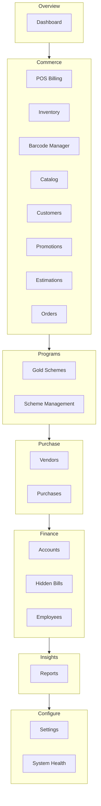

**Typical daily path for a cashier**

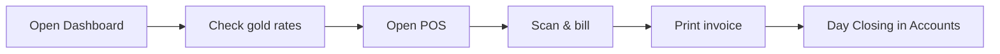

---

## 3. Getting started — login, roles & multi-PC

### What it is

Secure access for every staff member, with permissions that match their job. Multiple computers in the shop can work on the same data over LAN (one **Host** PC + staff PCs).

### Roles (examples)

| Role | Typical access |
|------|----------------|
| **Shop Owner** | Everything, including Hidden Bills & settings |
| **Manager** | Sales, stock, customers, reports |
| **Cashier** | POS, customers (view), limited inventory |
| **Accountant** | Accounts, reports, day closing |
| **Inventory Manager** | Catalog, inventory, barcodes |
| **Sales Executive** | POS, estimations, customers |
| **Gold Scheme Manager** | Schemes & scheme plans |
| **Repair Manager** | Orders (custom / repair) |

### Simple example

Priya is a cashier. She logs in and only sees **Dashboard**, **POS**, and **Customers**. She cannot open Settings or change gold rates.

### Flow

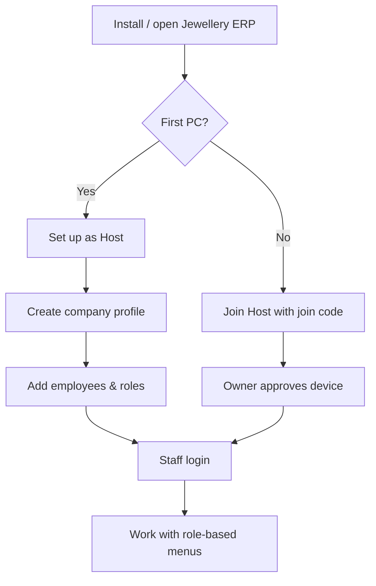

---

## 4. Dashboard

### What it is

Your morning snapshot of showroom activity — sales, cash, metal weight, and alerts.

### What you can do

- See **live gold / silver rates** (24K, 22K, 18K, Pure Silver, Silver) and update them
- View **Today’s Sales** and **Today’s Cash**
- Compare gold vs silver (today / month)
- Review **metal weight** for the last 7 days and purity mix
- Check **recent transactions**, top categories, **low-stock alerts**

### Simple example

Morning open: Owner opens Dashboard → updates 22K rate to ₹6,850/g → sees yesterday’s top category was “Bangles” and 3 tags are low stock.

### Flow

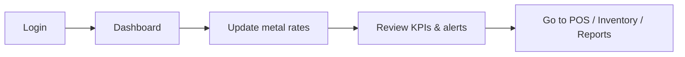

---

## 5. Catalog (Master Data)

### What it is

The “dictionary” of your shop — categories, counters, metals, purities, stones, units, collections, and tags. Inventory and POS depend on this.

### Sub-features

| Tab / area | Purpose |
|------------|---------|
| Categories & Sub-categories | e.g. Rings → Men’s / Women’s |
| Category Counters | Physical counter / location in showroom |
| Collections | Seasonal or brand collections |
| Tags | Labels for filtering (e.g. “Wedding”, “Lightweight”) |
| Metal Types | Gold, Silver, etc. |
| Stone Types | Diamond, Ruby, CZ… |
| Purities | 18K, 22K, 24K, 925, 999… |
| Units | Grams, Piece, Tray |
| Custom attributes | Extra fields (colour, design code, etc.) |

### Simple example

Before selling, you create Category **Necklaces**, Sub-category **Temple**, Counter **A1**, Purity **22K**, Unit **Grams**. Every necklace tag then uses this master data.

### Flow

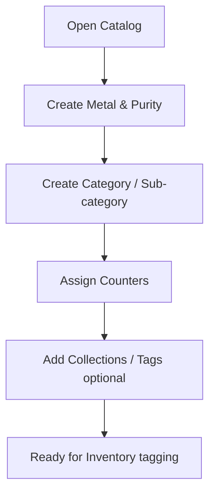

---

## 6. Inventory

### What it is

Every piece in your showroom — catalogued, weighed, hallmarked, and tracked until sold.

### What you can do

- List stock: **In Stock / Out of Stock**
- Filter by status: Available, On Display, Reserved, Damaged, Sold, Discontinued
- Filter low stock; see category overview; export CSV
- **Add / Edit product** with:
  - Metal & purity  
  - Identity (category → counter)  
  - Tray, weights (gross / net / stone)  
  - Stones, making & charges  
  - Tax & HSN  
  - Price & stock  
  - Collections & tags  
  - Tag status history  

### Simple example

New 22K ring arrives: Staff creates product → Gross 4.20 g, Net 4.05 g → Making ₹450 → HSN set → Status **Available** → barcode printed → ready for POS scan.

### Flow

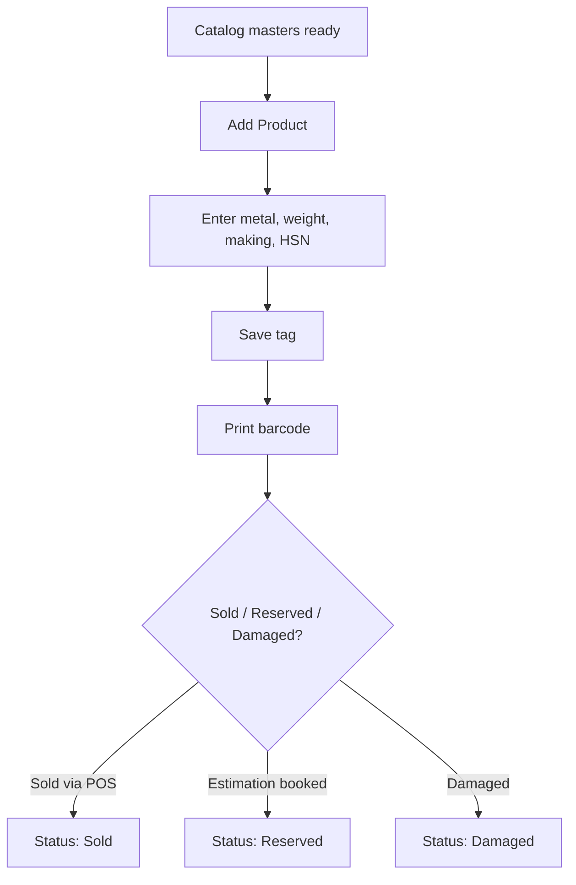

---

## 7. Barcode Manager

### What it is

Print jewellery barcode tags (Gross Weight / Net Weight / Stone Weight layout) for inventory.

### What you can do

- Choose tag templates (strip / pin styles)
- Generate missing barcodes
- View barcode stats
- Print via TSPL label printers or HTML print

### Simple example

After adding 50 new tags, Inventory Manager opens Barcode Manager → selects “pin tag” template → prints all missing barcodes in one batch.

### Flow

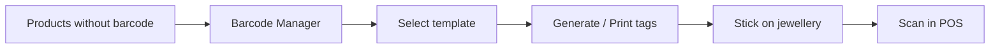

---

## 8. POS Billing

### What it is

The billing counter — fast scan-and-sell for jewellery and pure metal, with payments, GST, schemes, and advances.

### Modes

| Mode | Used for |
|------|----------|
| **Jewellery** | Tagged ornaments (rings, chains, etc.) |
| **Pure Gold / Silver** | Bullion / pure metal sales with rate lock |

### What you can do

- Scan barcode or search product → add line items  
- Select **salesperson** and **customer** (create customer on the fly)  
- Tabs: **Bill Summary** / **Payment** / **History**  
- Payments: Cash, UPI, Card, Bank Transfer, Cheque, **Old Gold Exchange**, split payments  
- Apply **scheme credit** and **customer advance**  
- Load a booked **Estimation** (rate-locked) and collect balance  
- Hold bills; save **Pending Sales** when host is offline  
- Sales return / credit notes; cancel invoice; collect balance payment  

### Simple example

Customer buys a 22K bangle:

1. Cashier opens POS → Jewellery mode  
2. Scans barcode → item appears with weight & making  
3. Selects customer “Anita Sharma” and salesperson “Ravi”  
4. Anita pays ₹20,000 UPI + ₹5,000 cash  
5. Invoice prints; stock becomes **Sold**; accounts update automatically  

### Flow

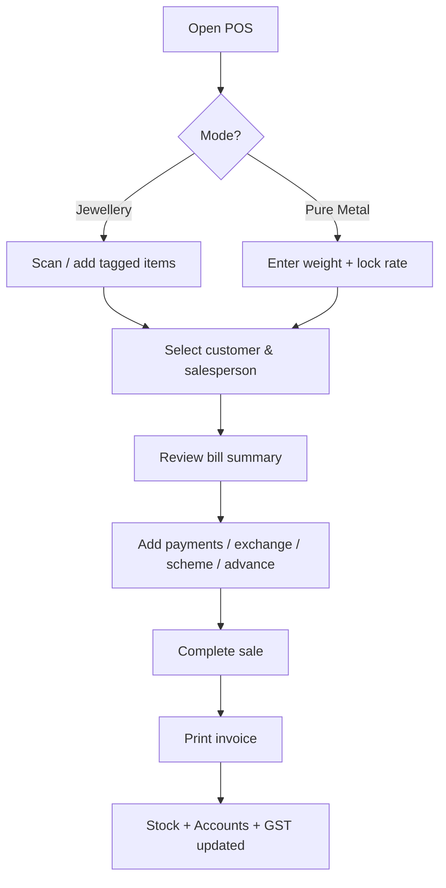

**Estimation → POS settle**


---

## 9. Customers

### What it is

Your customer ledger — every relationship, birthday, purchase, advance, and outstanding.

### Customer 360 (detail page)

| Section | What you see |
|---------|----------------|
| Bookings & advances | Estimation advances, balance |
| Purchase history | Past invoices |
| Outstanding balances | Pending dues |
| Party ledger | Running account |
| Gold saving schemes | Active enrolments |

### Simple example

Anita calls asking “How much do I still owe?” Staff opens Customers → Anita → Outstanding → sees ₹8,500 pending on a booked estimation.

### Flow

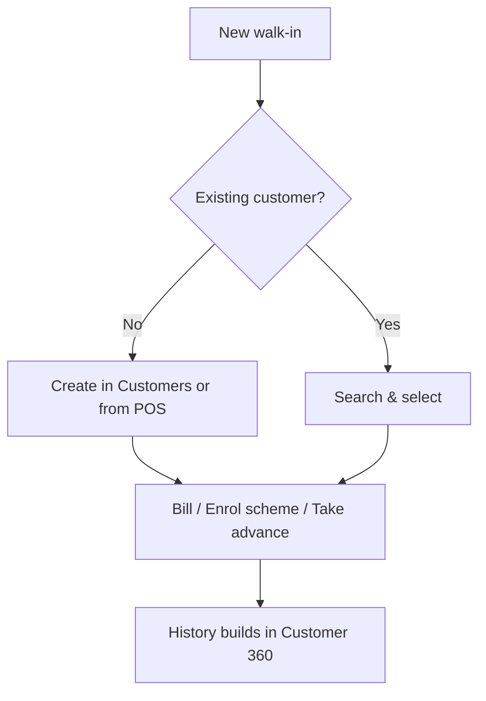

---

## 10. Estimations (Quotations)

### What it is

Give a customer a printed estimation, optionally take advance and **lock today’s rate**, reserve tags, then convert to a full sale later.

### Statuses

`Draft` → `Sent` → `Finalized` → `Booked` → `Converted` / `Expired` / `Cancelled`

### What you can do

- New Estimation / History tabs  
- Rate-based pricing; print; share on WhatsApp  
- **Take advance & lock rate** (reserves tags)  
- Add advance installments  
- Cancel booking (refund + release stock)  
- Convert / load into POS  

### Simple example

Wedding customer wants 3 sets but will pay next week. Staff creates Estimation → locks 22K rate → takes ₹50,000 advance → tags reserved. Next week, POS loads estimation, customer pays balance, invoice created.

### Flow

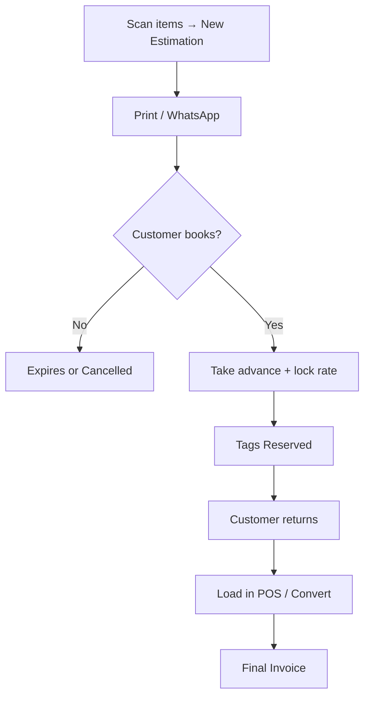

---

## 11. Orders (Custom & Repair)

### What it is

Track custom-made jewellery and repair jobs from receipt to delivery, with karigar assignment.

### Order types

- **New Custom Order**  
- **New Repair Job**

### Kanban statuses

`Received` → `Karigar Assigned` → `In Progress` → `Quality Check` → `Ready` → `Delivered`  
(or `Cancelled`)

### Simple example

Customer brings a broken chain. Staff creates Repair Job → assigns Karigar “Suresh” → moves card to In Progress → Quality Check → Ready → Delivered when customer picks up.

### Flow


---

## 12. Promotions

### What it is

WhatsApp marketing campaigns to the right customer segments.

### Campaign types

Festival · Birthday · Anniversary · Scheme Reminder · Scheme Maturity · New Collection · Custom

### Segments (examples)

All · VIP · Birthday this month · Anniversary this month · Scheme overdue / matured · Inactive 6+ months · High value

### Simple example

Before Diwali, Manager creates “Festival” campaign → segment “VIP” → preview list → send WhatsApp offer for new bridal collection.

### Flow

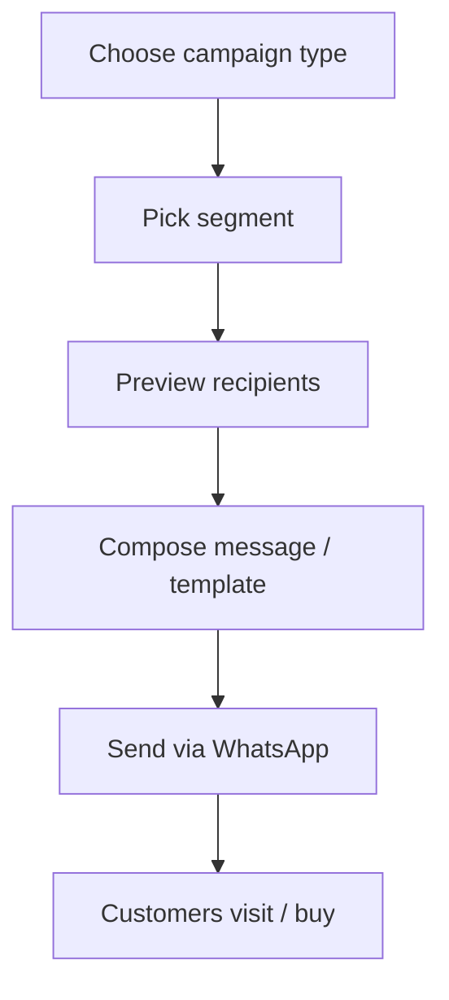

---

## 13. Gold Schemes

### What it is

Track monthly gold commitments — enrolments, collections, maturity, and redemption.

### What you can do

- Enrol members against a scheme plan  
- Record monthly installments  
- Issue maturity certificates  
- Redeem at maturity  
- Assign salesperson; filter Active / Matured / Completed / Cancelled  

### Simple example

Meena joins an 11+1 cash saving plan of ₹5,000/month. Staff enrols her → each month records ₹5,000 → after 11 months, bonus month applies → maturity certificate → she redeems against jewellery purchase in POS.

### Flow

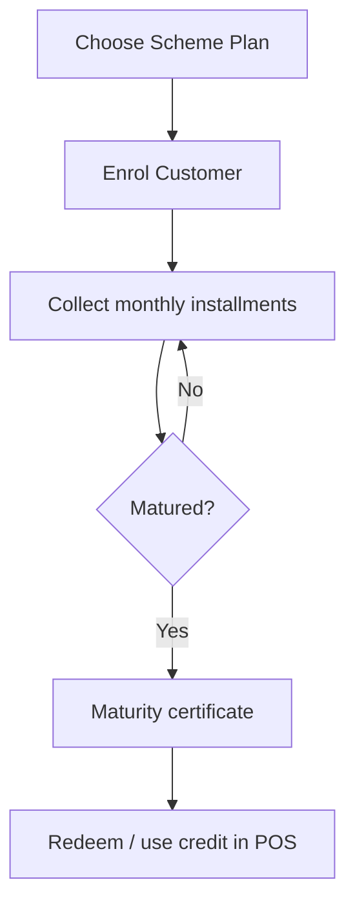

---

## 14. Scheme Management

### What it is

Define the **plans** that Gold Schemes use (rules, duration, bonus).

### Plan types

| Type | Example |
|------|---------|
| **Bonus Month** | 11+1, 10+1 — pay N months, get 1 bonus |
| **Standard** | 6 / 12 / 18 / 24 months |

| Saving style | Meaning |
|--------------|---------|
| **Cash Saving** | Fixed monthly amount |
| **Gold Saving** | Weight-based accumulation |

### Simple example

Owner creates plan “Swarnavarsha 11+1” — Cash Saving ₹2,000–₹10,000, bonus 1 month — activates it. Schemes module can now enrol customers on this plan.

### Flow

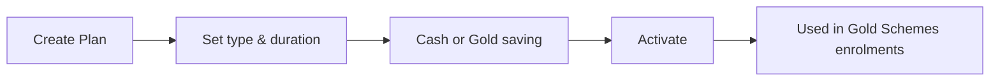

---

## 15. Vendors

### What it is

Directory of suppliers and karigars you buy from or send work to.

### Vendor types

Gold Supplier · Stone Supplier · Manufacturer · Karigar · Other

### Form areas

Basic Info · Bank Details · Credit terms · Active / Inactive

### Simple example

You add “Rajesh Bullion Traders” as Gold Supplier with bank account and 15-day credit. Purchases later link to this vendor for payables.

### Flow

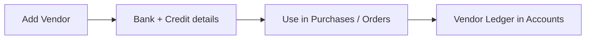

---

## 16. Purchases

### What it is

Record goods and metal you buy — from draft to fully paid — and feed stock / accounts.

### Purchase types

Gold Bullion · Finished Goods · Stones · Karigar Work · Other

### Statuses

`Draft` → `Received` → `Partially Paid` → `Paid`

### Simple example

Shop buys 100 g of 24K bullion. Accountant creates Purchase → Vendor Rajesh → lines with weight & rate → GST → marks Received → pays via bank → status Paid. Metal position updates.

### Flow

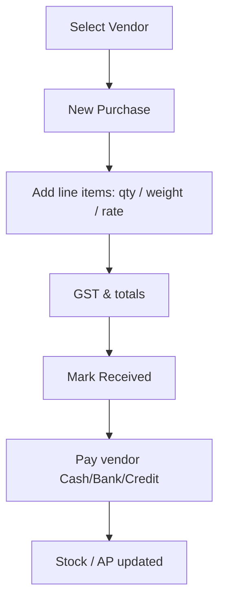

---

## 17. Accounts — every tab & sub-tab

### What it is

Accounts is the shop’s finance control room. The left/top navigation is organised into **7 groups**. Each group has one or more **tabs**. Use date presets (Today, This Week, This Month, Custom) on most screens; export or print where needed.

### How the Accounts menu is organised

```mermaid
flowchart TB
  subgraph Accounts
    G1[1. Overview]
    G2[2. Daily ops]
    G3[3. Sales and receivables]
    G4[4. Purchases and payables]
    G5[5. Cash and bank]
    G6[6. Metal, schemes and tax]
    G7[7. Statements and control]
  end
  G1 --> DASH[Dashboard]
  G2 --> DC[Day Closing]
  G2 --> PM[Pure Metal Daily]
  G2 --> DB[Day Book]
  G3 --> SA[Sales Accounts]
  G3 --> CR[Customer Receivables]
  G3 --> RC[Receipts]
  G3 --> CL[Customer Ledger]
  G4 --> PA[Purchase Accounts]
  G4 --> VP[Vendor Payables]
  G4 --> PY[Payments]
  G4 --> VL[Vendor Ledger]
  G4 --> EX[Expenses]
  G5 --> CB[Cash Book]
  G5 --> BB[Bank Book]
  G5 --> BR[Bank Reconciliation]
  G6 --> GM[Gold / Metal]
  G6 --> SCH[Scheme Accounts]
  G6 --> GST[GST / Tax]
  G7 --> ST[P and L / BS / TB / Vouchers]
  G7 --> AU[Audit Trail]
  G7 --> IN[Integrity / Cutover]
```

---

### Group 1 — Overview

#### Tab: Dashboard

**Purpose:** One-screen health of money in the business.

**What you see (KPIs):**
| KPI | Meaning |
|-----|---------|
| Total Sales | Billed sales in the selected period |
| Total Purchases | Purchases recorded |
| Cash in Hand | Cash GL balance |
| Bank Balance | Combined bank GL |
| Receivables | Customers still to pay you |
| Payables | You still to pay vendors |
| GST Payable | Net tax liability snapshot |
| Exchange Value | Old-gold exchange taken |
| Expenses | Shop expenses total |
| Gold Purchases | Value of gold bought |

Also shows **today’s** sales / collections / purchases / expenses / payments, payment-mode breakup, top unpaid invoices, and top unpaid POs.

**Example:** Owner opens Accounts → Dashboard on Monday morning. Sees Receivables ₹2.4L and Payables ₹1.1L. Drills into Customer Receivables next to chase dues before buying more bullion.

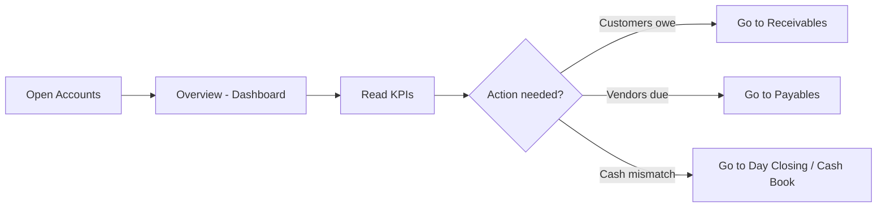

---

### Group 2 — Daily ops

#### Tab: Day Closing

**Purpose:** End-of-day till close — match physical cash with system, then lock the day.

**What you see / do:**
- KPIs: Total Sales, Total Collection, Cash Difference, Gold Sold (g), Silver Sold (g), Bill count  
- Payment breakup: Cash, Card, UPI, Bank, Cheque, Advance Used, Old Gold, Finance  
- Cash reconciliation: Opening cash → + cash sales − cash expenses → **Expected cash** vs **Cash counted (physical)** → Difference  
- Day snapshot: Expenses list, Old-gold exchange, Scheme collections, Advances, Returns/credit notes, Discounts, GST, Pending/hold bills  
- Checklist before close: Cash verified · UPI verified · Expenses entered · Stock checked · Rates checked  
- Statuses: **Open** → **Draft** (saved) → **Closed** (locked)

**Example:**  
System expected cash = ₹1,25,400. Cashier counts ₹1,25,150. Difference −₹250 noted (petty tea expense missed). Accountant adds expense ₹250, rechecks difference ₹0, ticks checklist, closes the day.

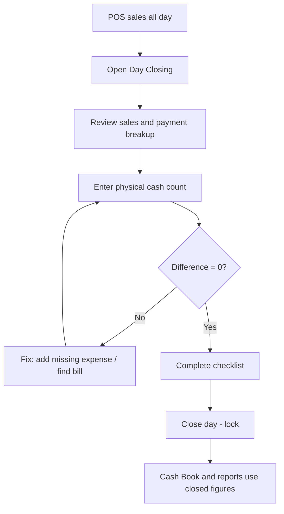

#### Tab: Pure Metal Daily

**Purpose:** Daily weight sheet for **pure gold** and **pure silver** (not tagged jewellery).

**What you do per metal:**
- Enter / confirm **Opening** weight (often carried from yesterday’s close)  
- Enter **Received** today (new bullion in)  
- System shows **Sold** from pure-metal POS bills  
- Enter physical **Closing** weight  
- System computes **Expected** = Opening + Received − Sold, and **Variance**

Statuses: Open → Draft saved → Closed.

**Example:** Gold opening 520.000 g, received 100.000 g, sold 12.450 g → expected 607.550 g. Physical close 607.540 g → variance −0.010 g (within tolerance) → close sheet.

```mermaid
flowchart TD
  A[Open Pure Metal Daily] --> B[Gold panel]
  A --> C[Silver panel]
  B --> D[Opening + Received]
  D --> E[System Sold from POS]
  E --> F[Enter Closing weight]
  F --> G{Variance OK?}
  G -->|No| H[Investigate shortage / excess]
  G -->|Yes| I[Save draft or Close]
```

#### Tab: Day Book

**Purpose:** Chronological list of every accounting voucher for the date range (sales, receipts, payments, expenses, journals).

**Columns:** Date · Voucher # · Type · Description · Debit · Credit

**Example:** Auditor asks “what happened on 5 Aug?” Accountant opens Day Book → filter 5 Aug → sees INV-1042 sale, RCPT-88 UPI receipt, EXP-12 electricity, and a manual journal — all in one list.

```mermaid
flowchart LR
  A[Pick date range] --> B[Day Book list]
  B --> C[Spot unusual voucher]
  C --> D[Open related module or Audit Trail]
```

---

### Group 3 — Sales & receivables

#### Tab: Sales Accounts

**Purpose:** Accounting register of sales invoices (taxable, CGST/SGST/IGST, paid, balance).

**Columns include:** Invoice · Date · Customer · Taxable · CGST · SGST · IGST · Total · Paid · Balance · Status

**Example:** Month-end GST prep starts here — filter This Month, export sales with tax columns, cross-check with GST / Tax tab.

#### Tab: Customer Receivables

**Purpose:** Who still owes the shop, how much, and for how many days.

**Columns:** Customer · Invoice · Date · Total · Outstanding · Days · Status

**Example:** Anita Sharma shows ₹8,500 outstanding for 12 days on a booked estimation balance. Staff calls her and records a receipt when she pays.

```mermaid
flowchart TD
  A[Open Receivables] --> B[Sort by Days / Amount]
  B --> C[Pick customer]
  C --> D[Open Customer Ledger]
  D --> E[Collect money]
  E --> F[Post Receipt]
  F --> G[Outstanding clears]
```

#### Tab: Receipts

**Purpose:** Money **received** from customers (against invoices, advances, balance payments).

**Columns:** Receipt # · Date · Type · Mode · Amount · Reference

**Example:** Customer pays ₹8,500 UPI against INV-1042. Receipt RCPT-201 appears here and also in Cash/Bank Book depending on mode.

#### Tab: Customer Ledger

**Purpose:** Running account for **one customer** — every debit/credit with balance (ops outstanding + GL AR view).

**Columns:** Date · Particular · Debit · Credit · Balance

**Example:** Anita’s ledger shows: Estimation advance credit ₹50,000 → Invoice debit ₹1,20,000 → Receipt credit ₹70,000 → Balance due ₹0.

```mermaid
flowchart LR
  A[Search customer] --> B[View ledger]
  B --> C[Explain balance to customer]
  C --> D[Take payment if due]
```

---

### Group 4 — Purchases & payables

#### Tab: Purchase Accounts

**Purpose:** Purchase register with tax, weight, paid and due amounts.

**Columns:** PO · Date · Vendor · Net Wt · Taxable · GST · Total · Paid · Due · Status

**Example:** Bullion PO-88 to Rajesh Traders — 100 g, GST applied, Partially Paid. Remaining shows under Vendor Payables.

#### Tab: Vendor Payables

**Purpose:** What you still owe suppliers / karigars, with ageing days.

**Example:** Rajesh Traders ₹1,85,000 due for 18 days. Accountant plans bank payment this week.

#### Tab: Payments

**Purpose:** Money **paid out** (vendor payments, etc.).

**Columns:** Payment # · Date · Type · Mode · Amount · Reference

**Example:** Pay ₹1,00,000 by bank transfer against PO-88 → Payment PAY-55 → payable reduces to ₹85,000.

#### Tab: Vendor Ledger

**Purpose:** Running account for **one vendor** (same idea as customer ledger, for AP).

**Example:** Karigar Suresh ledger: Work order debit ₹25,000 → Payment credit ₹10,000 → Balance ₹15,000.

#### Tab: Expenses

**Purpose:** Record shop running costs and manage **expense categories**.

**What you can do:**
- Add / edit / delete expenses (date, category, amount, description, payment mode)  
- Manage categories (e.g. Rent, Electricity, Packaging, Tea/Petty, Marketing, Hallmarking)  
- See period total  

**Example:** Electricity bill ₹6,800 paid by UPI → Add Expense → Category “Utilities” → appears in Day Closing expenses, Cash/Bank, and P&L.

```mermaid
flowchart TD
  A[Bill arrives] --> B[Accounts - Expenses]
  B --> C{Category exists?}
  C -->|No| D[Create category]
  C -->|Yes| E[Add expense]
  D --> E
  E --> F[Posted to books]
  F --> G[Shows in Day Closing and P and L]
```

```mermaid
flowchart LR
  A[Purchase created] --> B[Purchase Accounts]
  B --> C[Vendor Payables]
  C --> D[Make Payment]
  D --> E[Vendor Ledger updates]
```

---

### Group 5 — Cash & bank

#### Tab: Cash Book

**Purpose:** All cash-in and cash-out with running balance (Opening → In → Out → Closing).

**Example:** Opening ₹40,000 + cash sales ₹85,000 − cash expenses ₹3,200 → Closing ₹1,21,800. Must match Day Closing expected cash after close.

#### Tab: Bank Book

**Purpose:** Same for bank (UPI settlements, transfers, cheque clearances) with debit/credit/balance.

**Example:** UPI collections ₹2,10,000 and vendor NEFT ₹1,00,000 appear as bank lines for the day.

#### Tab: Bank Reconciliation

**Purpose:** Match ERP bank book with the actual bank statement.

**What you see / do:**
- Manage bank accounts (name, bank, A/c number, GL code, GL balance)  
- KPIs: ERP Balance · Statement Balance · Difference · Matched / Unmatched counts  
- Mark journal lines as reconciled against the statement  

**Example:** HDFC statement shows ₹5,42,100; ERP shows ₹5,40,100. Difference ₹2,000 = one UPI settlement not yet reflected in bank. After it clears next day, mark matched → difference ₹0.

```mermaid
flowchart TD
  A[Add / select bank account] --> B[Load period lines]
  B --> C[Compare with bank PDF / statement]
  C --> D{Line matches?}
  D -->|Yes| E[Mark reconciled]
  D -->|No| F[Investigate timing / missing entry]
  E --> G[Difference shrinks to zero]
```

---

### Group 6 — Metal, schemes & tax

#### Tab: Gold / Metal

**Purpose:** Metal stock position from inventory — pieces, gross/net weight, stock value, old-gold snapshot, inventory GL.

**Example:** Owner checks Gold / Metal before a big purchase: 22K net 1,240 g in stock worth ~₹X. Decides how much bullion to buy this week.

#### Tab: Scheme Accounts

**Purpose:** Financial view of gold-scheme liability — members, plans, monthly amount, paid/pending installments, total collected, status.

**Example:** Scheme liability (money collected but not yet redeemed) is visible here for balance-sheet awareness and scheme reports.

#### Tab: GST / Tax

**Purpose:** Tax summary from accounts: Sales Taxable, Output GST, Input GST, CGST/SGST/IGST in/out, **Net GST Liability**.

**Example:** For July: Output GST ₹1,12,000 − Input GST ₹38,000 → Net payable ₹74,000. Accountant uses this with Reports → GST for filing support.

```mermaid
flowchart LR
  A[Sales and Purchases post GST] --> B[GST / Tax tab]
  B --> C[Net liability]
  C --> D[Reports - GST registers for filing]
```

---

### Group 7 — Statements & control

#### Tab: P&L / Balance Sheet / TB *(sub-tabs inside)*

This one screen has **four sub-views**:

| Sub-tab | What it shows | When you use it |
|---------|---------------|-----------------|
| **Trial Balance** | All GL codes with debit & credit totals (must tally) | Month-end check that books balance |
| **P&L** | Income vs Expense → Net profit/loss (+ chart) | “Did we make profit this month?” |
| **Balance Sheet** | Assets, Liabilities, Equity as of a date (+ pie) | Owner / bank / auditor snapshot |
| **Vouchers** | Post a **manual journal** (debit/credit lines) | Corrections, opening adjustments, non-POS entries |

**Example — P&L:** August income ₹48L, expenses ₹6.2L → net profit ₹41.8L (jewellery margin + making − rent/salary/utilities).

**Example — Voucher:** Transfer ₹10,000 petty cash from Bank to Cash → Journal: Debit Cash 1000 / Credit Bank 1100 (codes as per your chart).

```mermaid
flowchart TD
  A[Open Statements tab] --> B{Choose sub-view}
  B --> TB[Trial Balance]
  B --> PL[P and L]
  B --> BS[Balance Sheet]
  B --> V[Manual Voucher]
  TB --> C[Confirm debit = credit]
  PL --> D[Review net profit]
  BS --> E[Review assets vs liabilities]
  V --> F[Post balanced journal]
```

#### Tab: Audit Trail

**Purpose:** Who did what — date, action, module, transaction id, user, reason.

**Example:** Invoice cancelled — Audit Trail shows User “manager1”, action Cancel, reason “Wrong customer”, timestamp.

#### Tab: Integrity / Cutover

**Purpose:** Health checks for accounting (trial balance OK, AR/AP control checks) and **cutover date** (when you started formal books / opening balances).

**Example:** After go-live, cutover set to 1 April. Integrity shows Trial Balance OK and AR control matching receivables list — safe to trust month-end statements.

```mermaid
flowchart TD
  A[Month end] --> B[Integrity check]
  B --> C{All green?}
  C -->|No| D[Fix unmatched AR/AP or TB]
  C -->|Yes| E[Run P and L and Balance Sheet]
  E --> F[Export / share with owner]
```

---

### Accounts — full daily-to-month flow

```mermaid
flowchart TD
  A[During day: POS, Purchases, Expenses, Scheme collections] --> B[Receipts and Payments]
  B --> C[Day Closing]
  C --> D[Pure Metal Daily if pure metal sold]
  D --> E[Cash Book / Bank Book look OK]
  E --> F[Weekly: Receivables chase + Payables pay]
  F --> G[Weekly: Bank Reconciliation]
  G --> H[Month end: GST / Tax + Trial Balance]
  H --> I[P and L + Balance Sheet]
  I --> J[Audit Trail if any disputes]
```

---

## 18. Hidden Bills (Owner only)

### What it is

PIN-protected, **owner-only** billing view for private jewellery / pure-metal bills that are kept separate from the normal billing list. Access requires Shop Owner role and a secret PIN unlock.

### Who sees it

Only the Shop Owner (after PIN unlock). Staff never see this menu.

### Simple example

Owner unlocks Hidden Bills with PIN → reviews private pure-metal bills for the week → locks again when done.

### Flow

```mermaid
flowchart TD
  A[Shop Owner] --> B[Unlock with PIN]
  B --> C[View / manage hidden bills]
  C --> D[Session lock / leave screen]
```

> **Note for customers:** This is an owner-control feature. Discuss usage policy with your implementation partner so it matches how your shop operates.

---

## 19. Employees

### What it is

Staff directory used for POS salespersons, scheme salespeople, and role assignment.

### Fields (typical)

Name, mobile, job title, department, salary, join date, status, address, emergency contact  

Suggested departments: Sales, Accounts, Management, Goldsmith, Security, Housekeeping  

### Simple example

New hire “Kavitha” joins Sales. Owner adds her under Employees → assigns role Sales Executive in Settings → she appears as salesperson in POS.

### Flow

```mermaid
flowchart LR
  A[Add Employee] --> B[Assign login role in Settings]
  B --> C[Appears in POS / Schemes]
  C --> D[Sales attributed in reports]
```

---

## 20. Reports — every category & report

### What it is

The **Report Center** is a single place to open every operational and financial report. Pick a **category** (left/top), then a **report** inside it. Set date range and filters, then view / print / export.

### How Reports is organised

```mermaid
flowchart TB
  RC[Report Center]
  RC --> E[Executive]
  RC --> F[Financial]
  RC --> S[Sales]
  RC --> C[Customers]
  RC --> SU[Suppliers]
  RC --> I[Inventory]
  RC --> J[Jewellery]
  RC --> G[GST]
  RC --> X[Expenses]
  RC --> SC[Schemes]
```

### Common flow for any report

```mermaid
flowchart TD
  A[Open Reports] --> B[Choose category]
  B --> C[Choose report name]
  C --> D[Set From / To dates]
  D --> E[Optional filters: counter, employee, metal...]
  E --> F[View table / charts]
  F --> G[Print or Excel / CSV]
  G --> H[Share with owner / CA / auditor]
```

---

### Category 1 — Executive

| Report | What it tells you | Simple example |
|--------|-------------------|----------------|
| **Business Overview** | High-level KPIs from live accounts + sales | Owner Monday review: sales, cash, dues at a glance |
| **Profitability (P&L)** | Journal-based profit & loss | “Are we profitable this month?” → Net profit ₹X |
| **Cash Position** | Cash book / cash on hand from GL | Before a big vendor payment, confirm cash headroom |

```mermaid
flowchart LR
  A[Owner opens Executive] --> B[Business Overview]
  B --> C{Need depth?}
  C -->|Profit| D[Profitability P and L]
  C -->|Liquidity| E[Cash Position]
```

---

### Category 2 — Financial

| Report | What it tells you | Simple example |
|--------|-------------------|----------------|
| **Profit & Loss** | Income − expenses for a period | August P&L for partner meeting |
| **Balance Sheet** | Assets / liabilities / equity as of a date | Bank loan discussion — share BS as of 31 Jul |
| **Trial Balance** | All accounts debit/credit must tally | Month-end: confirm books are balanced |
| **Day Book** | Every voucher in date order | Trace one confusing day |
| **Cash Book** | Cash in/out running balance | Match with Day Closing |
| **Bank Book** | Bank movements | Match with HDFC statement |
| **Receipt Register** | All money received | Prove Anita’s ₹8,500 was taken |
| **Payment Register** | All money paid | Prove vendor NEFT went out |
| **Customer Outstanding** | AR list | Collection calling list |
| **Supplier Outstanding** | AP list | Who to pay this week |
| **Accounting Integrity** | Controls / health of books | Before auditor visit |

```mermaid
flowchart TD
  A[Month end] --> B[Trial Balance]
  B --> C[P and L]
  C --> D[Balance Sheet]
  D --> E[Integrity check]
  E --> F[Hand to CA / owner]
```

---

### Category 3 — Sales

| Report | What it tells you | Simple example |
|--------|-------------------|----------------|
| **Sales Workspace** | Full sales analytics workspace (interactive) | Manager explores sales live |
| **Invoice Register** | Bill-by-bill sales list | Find INV-1042 details |
| **Sales by Employee** | Who sold how much | Ravi ₹12L, Kavitha ₹9L this month → incentives |
| **Sales by Counter** | Which counter / location sold | Counter A1 (bridal) outsold others |
| **Top Customers** | Highest purchase customers | VIP list for Diwali invites |
| **Top Products** | Best-selling tags / designs | Reorder lightweight bangles |
| **Sales Trend** | Sales over time | Compare week-on-week after rate hike |
| **Sales Accounts Register** | Sales from accounts books | Cross-check with Accounts → Sales |

```mermaid
flowchart TD
  A[Sales category] --> B[Invoice Register for detail]
  A --> C[By Employee for incentives]
  A --> D[Top Products for buying]
  A --> E[Trend for planning]
```

---

### Category 4 — Customers

| Report | What it tells you | Simple example |
|--------|-------------------|----------------|
| **Customers Workspace** | Interactive customer analytics | Browse segments |
| **Customer List Report** | Full customer dump | Export for WhatsApp / backup |
| **Pending Balance / Advances** | Who has advance or unpaid balance | Call estimation bookings due |
| **Purchase Frequency** | How often customers buy | Spot regulars vs one-timers |
| **Loyal Customers** | Repeat high-engagement buyers | Invite to private preview |
| **Inactive Customers** | No visit for a long time | Win-back campaign |
| **Top Spending** | Highest lifetime / period spend | Personal greeting from owner |
| **Birthdays** | Birthdays in range | Send birthday WhatsApp via Promotions |
| **Anniversaries** | Wedding anniversaries | Couple offer message |
| **Receivables Ageing** | Outstanding by age buckets | 0–30 / 31–60 / 60+ days chase plan |

```mermaid
flowchart TD
  A[Marketing week] --> B[Birthdays + Anniversaries]
  B --> C[Promotions WhatsApp]
  A --> D[Inactive Customers]
  D --> C
  A --> E[Receivables Ageing]
  E --> F[Collection calls]
```

---

### Category 5 — Suppliers

| Report | What it tells you | Simple example |
|--------|-------------------|----------------|
| **Purchases Workspace** | Interactive purchase analytics | Explore buy patterns |
| **Pending Payments** | Open payment dues | Pay list for Friday |
| **Outstanding Vendors** | Vendors with balance | Rajesh ₹1.85L still open |
| **Metal-wise Purchases** | Gold vs silver vs stones bought | Gold buy 2.1 kg this quarter |
| **Purchase Trend** | Purchases over time | Stock-up before wedding season |
| **Purchase Accounts** | Books view of purchases | Match Accounts → Purchase Accounts |
| **Payables Ageing** | AP by age | Prioritise oldest dues |

```mermaid
flowchart LR
  A[Suppliers reports] --> B[Pending Payments]
  B --> C[Pay via Accounts Payments]
  C --> D[Outstanding drops]
```

---

### Category 6 — Inventory *(includes Quick Reports)*

| Report | What it tells you | Simple example |
|--------|-------------------|----------------|
| **Inventory Workspace** | Interactive stock analytics | Live stock exploration |
| **Current Stock / Valuation** | What is in stock and its value | Insurance / audit stock value |
| **Category Stock** | Stock by category | Rings vs Bangles qty & weight |
| **Counter Stock** | Stock by showroom counter | Counter B2 overstocked |
| **Today's Stock Added** | Tags created today | Verify today’s tagging batch |
| **Dead Stock** | Not moving for long | Melting / discount decision |
| **Fast Moving** | Quick sellers | Reorder similar designs |
| **Stock Ageing** | How old tags are | Age buckets for MD review |
| **Tag History** | Status changes for a tag | “When was TAG-9021 reserved?” |
| **Stock Movement** | In/out movements | Trace a missing piece |
| **Stock Check** | Physical verification support | Monthly stock audit sheet |

```mermaid
flowchart TD
  A[Inventory Manager] --> B[Today Stock Added]
  B --> C[Print barcodes]
  A --> D[Dead Stock + Ageing]
  D --> E[Discount / melt plan]
  A --> F[Stock Check]
  F --> G[Physical count vs system]
```

---

### Category 7 — Jewellery

| Report | What it tells you | Simple example |
|--------|-------------------|----------------|
| **Jewellery / More Workspace** | Extra jewellery analytics workspace | Browse jewellery-specific views |
| **Metal Position** | Metal weight & value position | Same idea as Accounts → Gold/Metal |
| **Hallmark Report** | Hallmark-related listing | Compliance / BIS follow-up |
| **Old Gold Buybook** | Old gold taken in exchange | Weight & value of exchange this month |
| **Commission Report** | Staff commission basis | Pay salesperson incentives |
| **Gold Rate History** | How rates moved | Explain rate lock on an estimation |

```mermaid
flowchart LR
  A[Old gold exchanged in POS] --> B[Old Gold Buybook]
  B --> C[Day Closing exchange section]
  C --> D[Metal accounts]
```

---

### Category 8 — GST

| Report | What it tells you | Simple example |
|--------|-------------------|----------------|
| **GST Workspace** | Interactive GST area | Explore tax views |
| **Sales GST Register** | Invoice-wise tax | Primary GSTR working paper |
| **HSN Summary** | Tax by HSN code | HSN-wise filing support |
| **Tax Rate Summary** | Breakup by tax % | 3% / 5% / etc. check |
| **Monthly GST Summary** | Month roll-up | July vs August tax |
| **GST Liability** | What is payable | Remittance planning |
| **GST Accounts (CGST/SGST/IGST)** | From accounts ledgers | Match Accounts → GST / Tax |

**Example (filing week):**

```mermaid
flowchart TD
  A[Reports - GST] --> B[Sales GST Register - export]
  B --> C[HSN Summary - export]
  C --> D[Tax Rate Summary]
  D --> E[GST Liability]
  E --> F[Compare with Accounts GST / Tax]
  F --> G[CA files return]
```

---

### Category 9 — Expenses

| Report | What it tells you | Simple example |
|--------|-------------------|----------------|
| **Expense Register** | All expenses in date range | Print July expense list for owner |
| **Expenses in P&L** | How expenses sit inside profit & loss | See rent + salary impact on net profit |

```mermaid
flowchart LR
  A[Add expenses in Accounts] --> B[Expense Register report]
  B --> C[Expenses in P and L]
```

---

### Category 10 — Schemes

| Report | What it tells you | Simple example |
|--------|-------------------|----------------|
| **Schemes Workspace** | Interactive scheme analytics | Browse scheme health |
| **Schemes List** | All enrolments | Master list for scheme manager |
| **Upcoming Maturity** | Schemes maturing soon | Prepare certificates / stock for redemption |
| **Missed Installments** | Members who skipped a month | Call + WhatsApp reminder |
| **Overdue Schemes** | Seriously behind members | Escalation list |
| **Scheme Collections** | Money collected in period | Compare to target ₹/month |
| **Scheme Accounts Liability** | Books view of scheme liability | Match Accounts → Scheme Accounts |

```mermaid
flowchart TD
  A[Month start] --> B[Missed Installments]
  B --> C[Promotions - Scheme Reminder]
  A --> D[Upcoming Maturity]
  D --> E[Ready stock + certificates]
  E --> F[Redeem in POS]
```

---

### Reports — who uses which category

| Role | Start here |
|------|------------|
| **Shop Owner** | Executive, Financial (P&L / BS), Cash Position |
| **Accountant / CA prep** | Financial, GST, Expenses, Integrity |
| **Manager** | Sales, Customers, Inventory ageing |
| **Inventory Manager** | Inventory quick reports, Jewellery metal |
| **Scheme Manager** | Schemes (maturity, missed, collections) |
| **Sales lead** | Sales by Employee, Commission, Top Products |

### Reports vs Accounts — quick guide

| Need | Prefer |
|------|--------|
| Day close / till match | **Accounts → Day Closing** |
| Post expense / receipt / payment | **Accounts** |
| File GST / analyse sales / stock / schemes | **Reports** |
| Formal P&L / Balance Sheet | Either **Accounts → Statements** or **Reports → Financial** (same books) |

---

## 21. Settings

### What it is

Configure the shop once; adjust as the business grows.

| Tab | Purpose |
|-----|---------|
| **Company** | Name, logo, GSTIN, owner (protected edits) |
| **Gold Rate** | Daily rates used by Dashboard & POS |
| **Billing** | Invoice format, GST %, payment modes |
| **Hidden Bill** | Owner secret / PIN setup |
| **Permissions** | Roles & module actions (incl. POS jewellery / pure metal) |
| **Devices** | Multi-PC join, approve, pairing, ownership transfer |
| **Printers & Devices** | Receipt / label printers, scanners |
| **Shop Network** | LAN host / client |
| **System Health** | Diagnostics shortcut |
| **Audit** | Who changed what |
| **Backup & Export** | Data backup / export |
| **Import CSV** | Customers, Products, Vendors, Employees, Quotations, Expenses |

### Simple example

New branch PC: Settings → Devices → generate join code → staff PC joins → Owner approves → printers configured → ready for POS.

### Flow

```mermaid
flowchart TD
  A[Company profile] --> B[GST & Billing rules]
  B --> C[Roles & Permissions]
  C --> D[Devices & Network]
  D --> E[Printers]
  E --> F[Backup schedule]
```

---

## 22. System Health

### What it is

Operational status for multi-PC shops — host connection, cluster/authority state, and local database health.

### Simple example

Cashier PC shows “Host unreachable”. Manager opens System Health → confirms network issue → reconnects LAN → POS sync resumes.

### Flow

```mermaid
flowchart LR
  A[Open System Health] --> B[Check Host link]
  B --> C[Check DB health]
  C --> D[Fix network / restart if needed]
```

---

## 23. End-to-end business journeys

These journeys show how modules connect in real shop life.

### Journey A — Tag to sale (retail)

```mermaid
flowchart TD
  A[Catalog masters] --> B[Create Inventory tag]
  B --> C[Print Barcode]
  C --> D[Display in showroom]
  D --> E[POS scan & bill]
  E --> F[Invoice + GST]
  F --> G[Stock Sold]
  G --> H[Accounts / Day Closing]
```

### Journey B — Estimation booking

```mermaid
flowchart TD
  A[Estimation] --> B[Advance + rate lock]
  B --> C[Tag Reserved]
  C --> D[Customer returns]
  D --> E[POS settle balance]
  E --> F[Converted Invoice]
```

### Journey C — Purchase metal / goods

```mermaid
flowchart TD
  A[Add Vendor] --> B[Create Purchase]
  B --> C[Receive goods / bullion]
  C --> D[Pay vendor]
  D --> E[Stock + Vendor Payable]
  E --> F[Accounts & Reports]
```

### Journey D — Custom / repair

```mermaid
flowchart TD
  A[Create Order] --> B[Assign Karigar Vendor]
  B --> C[Track Kanban stages]
  C --> D[Ready]
  D --> E[Deliver to customer]
```

### Journey E — Gold scheme lifecycle

```mermaid
flowchart TD
  A[Scheme Management: create plan] --> B[Gold Schemes: enrol]
  B --> C[Monthly collections]
  C --> D[Reminders via Promotions]
  D --> E[Maturity]
  E --> F[Redeem in POS against jewellery]
```

### Journey F — Day end

```mermaid
flowchart TD
  A[All POS sales done] --> B[Receipts & Payments]
  B --> C[Day Closing]
  C --> D[Pure Metal Daily optional]
  D --> E[Review Cash / Bank Book]
  E --> F[Backup]
```

---

## 24. Quick reference — who uses what

| Person | Primary modules |
|--------|-----------------|
| **Shop Owner** | Dashboard, Settings, Accounts, Reports, Hidden Bills, Schemes |
| **Manager** | Dashboard, POS, Inventory, Customers, Estimations, Orders, Reports |
| **Cashier** | POS, Customers (lookup), Day Closing (if allowed) |
| **Accountant** | Accounts, Purchases, Vendors, Reports (GST / P&L) |
| **Inventory Manager** | Catalog, Inventory, Barcode Manager |
| **Sales Executive** | POS, Estimations, Customers, Promotions |
| **Scheme Manager** | Scheme Management, Gold Schemes, Scheme reports |
| **Repair Manager** | Orders, Vendors (Karigar) |

---

## Appendix — Module map (one page)

| # | Module | One-line purpose |
|---|--------|------------------|
| 1 | Dashboard | Today’s rates, sales, alerts |
| 2 | Catalog | Master data for products |
| 3 | Inventory | Tagged stock lifecycle |
| 4 | Barcode Manager | Print jewellery tags |
| 5 | POS Billing | Sell jewellery & pure metal |
| 6 | Customers | Relationship & 360° ledger |
| 7 | Estimations | Quote, lock rate, take advance |
| 8 | Orders | Custom make & repair pipeline |
| 9 | Promotions | WhatsApp campaigns |
| 10 | Scheme Management | Define gold saving plans |
| 11 | Gold Schemes | Enrol, collect, mature, redeem |
| 12 | Vendors | Suppliers & karigars |
| 13 | Purchases | Buy metal / goods / work |
| 14 | Accounts | Books, day close, GST, statements |
| 15 | Hidden Bills | Owner-only private bills |
| 16 | Employees | Staff master |
| 17 | Reports | Analytics & compliance |
| 18 | Settings | Company, roles, devices, backup |
| 19 | System Health | Multi-PC diagnostics |

---

*Document version: Customer Product Guide · Jewellery ERP*  
*Use this guide for demos, training, and onboarding. For technical install / recovery, see the separate deployment and recovery guides.*
